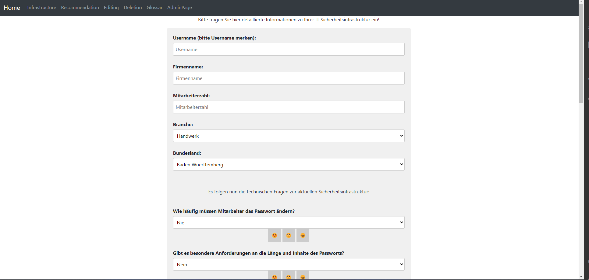
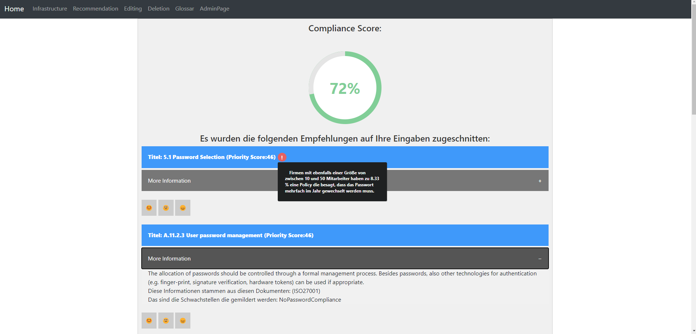
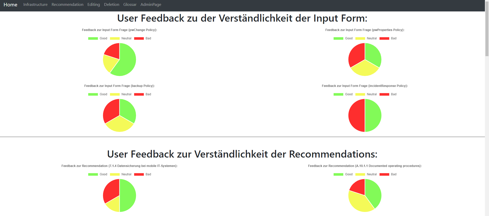

# Security Assistant Application

## Description

The Security Assistant Application is a web-based tool that helps esepecially small and medium sized enterprises with the selection of IT-security measures. As smaller companies usually do not have the resources and knowledge to make good security decisions, this assistant should start right there and provide tailor-made recommendations to improve IT security. To be able to provide these individual recommendations, the assistant tries to capture the current individual situation of the companies.

## Features

- Capturing of the current individual IT infrastructure through a input form

- Generation of personalized IT-security recommendations and display on the web

- Prioritization of the recommendations and description of origin
- Description of the benefits of already implemented security measures
- Calculation of current compliance score
- (Download of the recommendations in a .txt file)
- Confidential treatment of personal user data and secure storing of user information
- Edition and deletion of all company data if required
- Admin console for the providers with detailed user feedback about the application and about the clarity of recommendations

- The recommendations are also enriched with statistical information about the implementation of security measures in similar-sized companies in related industries

## Technologies Used

- Java
- Apache Jena
- Spring Boot
- Thymeleaf (for HTML templates)
- MySQL (or your preferred database)
- Docker (optional - for containerization)

## Installation and Setup

1. Go to https://maven.apache.org/download.cgi and download the Maven Zip file. Afterwards unzip it to your "C: driver" into the 
`C:\Program Files`

2. Set up Path Variables  
-Click on the search bar on the bottom left of your screen and search for "edit the system variables"  
-Click "Environment Variables..." on the bottom right  
-At "System variables" double click "PATH", then click "new" and add the path to the bin directory of your Apache Maven download. For example:  `C:\Program Files\apache-maven-3.9.4\bin` (Change version accordingly) and press "OK".  
-Then create a new User Variable on top with the Variable Name: `MAVEN_HOME` and Variable Value: `C:\Program Files\apache-maven-3.9.4` (Change to the right version or better just copy the path from your explorer) --> Then confirm by clicking "Ok" three times.

3. Download Git from https://git-scm.com/downloads and download the appropriate Git version for your OS.  
Execute the Git Installer and accept every pre-defined setting while clicking through the Installer.

4. Go to the IDE of your choice and clone the repository in the command line
`git clone https://github.com/SchimSlady/SecurityAssistant.git`

5. Go the directory folder just cloned by using `cd SecurityAssistant` and open the SecurityAssistant folder in your IDE.

6. The security ontology used for this application is stored in the folder `/SecurityAssistant/src/main/java/com/example/ontology/files`.  
- Before your run the application for the first time, the `file path` variable of the locally stored security ontology must be changed manually. In the class `/SecurityAssistant/src/main/java/com/example/ontology/InitJena.java` change the filePath in line 58 to the absolute path to your locally stored security ontology.  
- This should look like this: `filePath = "file:/C:/Users/Wiwi-Admin/SecurityAssistant/src/main/java/com/example/ontology/files/Mueller2023_Security_shortened.rdf";`.  
- It's important that forward slashes "/" are used!

7. Then build the application: `mvn clean package`.

8. Run the main method in `SecurityAssistant/src/main/java/com/example/SecurityAssistant`.

9. Open your web browser and navigate to `http://localhost:8080` to access the application.

## Usage

- To generate a recommendation you have to provide a detailed overview over your current infrastsructure and accept the processing of your user data
- You can see the displayed recommendations after a loading time. Press more information to get further insights on the recommendation titles
- Hover the red exlamation marks to see more statistical information about the implementation of certain security measures of similar companies
- Insert your username in the delete/edit input field to delete/edit your input data
- Provide the provider with feedback by giving feedback about the clarity of the input form or the recommendations through the emojis

## Important things to know

Since this software application was developed to evaluate the system design of two bachelor theses, the application is not 100% bug free in the final detail. Nevertheless, the application fulfills all functional requirements. However, some minor details are not yet fully implemented. These should be taken into account when releasing the application!  

The following points must be taken into account:
- The following questions in the User Input Form are currently not provided with any functionality in the back-end:
    - "Wo werden die Daten bei Ihnen abgelegt?"
    - "Arbeiten Sie mit einem externen Sicherheitsdienstleister zusammen?"
    - "Bitte spezifizieren Sie die Anzahl PCs:"
    - "Haben Sie einen Drucker im Einsatz der mit dem Internet verbunden ist?"  
- The download of the text file that contains the generated recommendations does not work properly: the file gets downloaded, but there is no content in the file.
 
    

## Contributing

Contributions are welcome! If you find any bugs or have suggestions for improvements, please submit an issue or a pull request.

## License

This project is licensed under the [MIT License](LICENSE).

